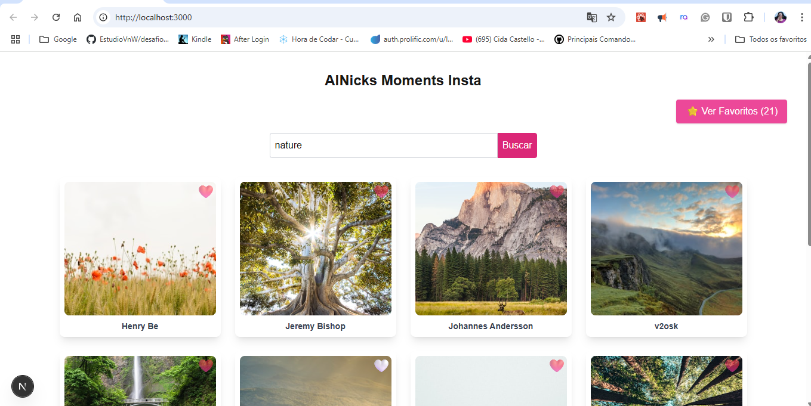
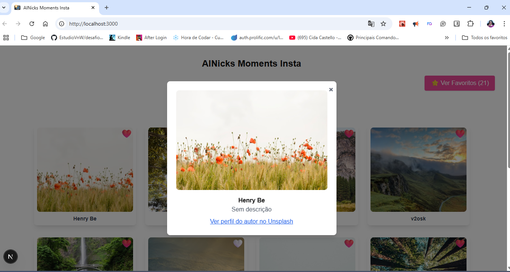

# 📸 AlNicks Moments Insta

Bem-vindo(a) ao **AlNicks Moments Insta**!  
Um mini Instagram de fotos feito com carinho, inspirado nos meus filhos: **Alicia + Nickolas = AlNicks**!  
Desenvolvido com **Next.js 14+, Tailwind CSS, TypeScript** e integração com a **API do Unsplash**.

---

## ✨ Funcionalidades

- **Feed de Fotos Aleatórias:** Grid de fotos em alta qualidade (lazy loading).
- **Busca Personalizada:** Pesquise por termos (natureza, animais, cidades...).
- **Favoritar Fotos:** Salve suas imagens preferidas com localStorage.
- **Visualização em Modal:** Clique na foto para ver detalhes, autor, descrição e link do Unsplash.
- **Remover Favoritos:** Tire fotos dos favoritos individualmente ou limpe tudo.
- **Design Responsivo:** Funciona lindamente em desktop e mobile.
- **Animações Suaves:** Mais fluidez na experiência.
- **Tratamento de Erros:** Mensagens amigáveis para buscas vazias ou erro de API.

---

## 🚀 Tecnologias Utilizadas

- Next.js 14+
- React
- TypeScript
- Tailwind CSS
- Zustand
- Unsplash API

---

## 🗂️ Estrutura do Projeto

````text
desafio-front-end/
├── public/
│   ├── file.svg
│   ├── globe.svg
│   ├── home.png
│   └── ...
├── src/
│   ├── app/
│   ├── components/
│   └── ...
└── README.md


---

## ⚙️ Como Rodar o Projeto

### Pré-requisitos

- Node.js 18.x ou superior
- npm ou Yarn
- Chave da [Unsplash API](https://unsplash.com/developers)

### Instalação

```bash
git clone https://github.com/ThatianaMattos/desafio-front-end.git
cd desafio-front-end

# Crie um arquivo .env.local na raiz do projeto e adicione:
NEXT_PUBLIC_UNSPLASH_ACCESS_KEY=sua_chave_aqui

# Instale as dependências:
npm install
# ou
yarn install
Rode o projeto:
npm run dev
# ou
yarn dev
Acesse: http://localhost:3000
🖼️ Prints do Projeto





---
## 🚀 Deploy

Projeto disponível em produção:
👉 [Clique aqui para acessar a aplicação!](https://desafio-front-end-seven.vercel.app)


---
## Licença

Projeto aberto para fins educacionais.<br>
“Tecnologia também cria memórias afetivas!” – Thatiana Mattos

---
## Contato

Feito com 💙 por [Thatiana Mattos](https://www.linkedin.com/in/thatiana-mattos/) | [GitHub](https://github.com/ThatianaMattos)


````
